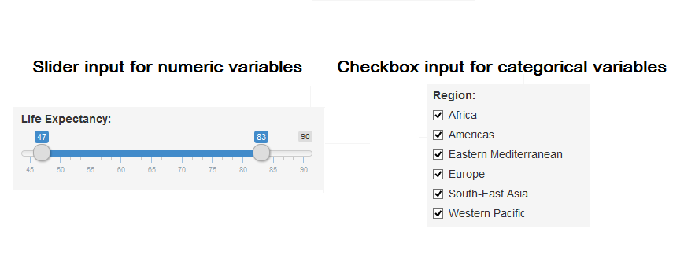
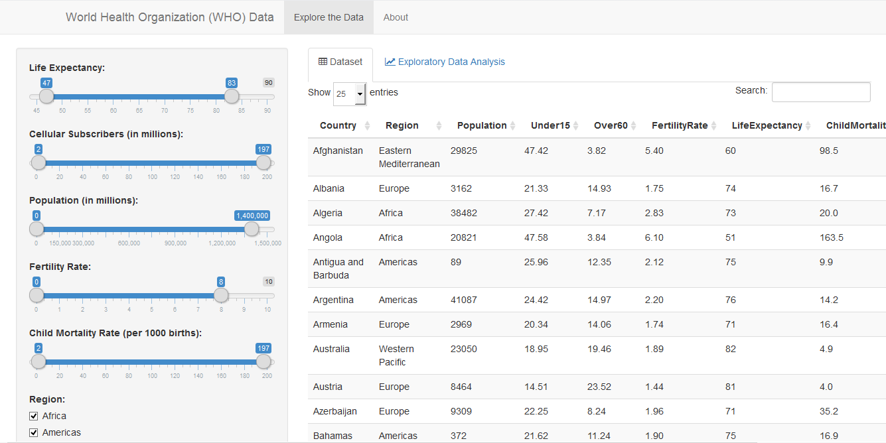

## Introduction

This app provides you the data on social indicators of all countries. You can customize the data as per your requirements just by a click.


--- .class #id 

## WHO data

The dataset consists of 177 observations with 9 parameters such as Country, Region, Fertility Rate, Population, etc.

The following are the variables of the dataset:

```
##                 Country                      Region     Population     
##  Afghanistan        :  1   Africa               :46   Min.   :     89  
##  Albania            :  1   Americas             :32   1st Qu.:   2969  
##  Algeria            :  1   Eastern Mediterranean:21   Median :   9405  
##  Angola             :  1   Europe               :48   Mean   :  39689  
##  Antigua and Barbuda:  1   South-East Asia      :11   3rd Qu.:  28288  
##  Argentina          :  1   Western Pacific      :19   Max.   :1390000  
##  (Other)            :171                                               
##     Under15          Over60      FertilityRate   LifeExpectancy 
##  Min.   :13.12   Min.   : 0.81   Min.   :1.260   Min.   :47.00  
##  1st Qu.:18.64   1st Qu.: 5.10   1st Qu.:1.840   1st Qu.:63.00  
##  Median :28.65   Median : 8.10   Median :2.400   Median :72.00  
##  Mean   :28.89   Mean   :10.98   Mean   :2.936   Mean   :69.74  
##  3rd Qu.:38.49   3rd Qu.:16.59   3rd Qu.:3.900   3rd Qu.:76.00  
##  Max.   :49.99   Max.   :31.92   Max.   :7.580   Max.   :83.00  
##                                                                 
##  ChildMortality   CellularSubscribers
##  Min.   :  2.20   Min.   :  2.57     
##  1st Qu.:  8.50   1st Qu.: 63.17     
##  Median : 19.10   Median : 98.45     
##  Mean   : 37.49   Mean   : 93.94     
##  3rd Qu.: 58.30   3rd Qu.:121.66     
##  Max.   :181.60   Max.   :196.41     
## 
```

--- .class #id 

## The core idea

- Categorical variables are listed in the GUI as checkboxes
- Numerical variables are listed as slider input
- You can vary the slider or use the checkboxes to customize the data according to your needs immediately



--- .class #id 

## The App

Link: https://arj27083.shinyapps.io/Apps/



--- .class #id 
